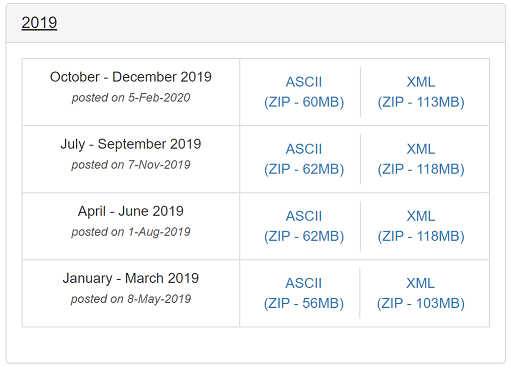

# Deployment Guide
Please follow the steps below to set up the Azure environment.

## Step 1. Download Datasets
There are 2 data sources that will be used to build the solution.  Due to the size of the data, you will download the data directly from their website.

1. [State Drug Utilization Database](https://www.medicaid.gov/medicaid/prescription-drugs/state-drug-utilization-data/index.html) (SDUD) - This data represents covered outpatient drugs paid for by state Medicaid agencies.  This data will be used to analyze drug prescription trends between the years 2018-2021.

      Navigate to the year of interest and navigate to the last page.  Select the link `State Drug Utilization Data 2018` and download the data to your local machine.

      

      Repeat this for years 2019-2021.  Make sure you have downloaded the following datasets (.csv):
      - State Drug Utilization Data 2018
      - State Drug Utilization Data 2019
      - State Drug Utilization Data 2020
      - State Drug Utilization Data 2021

2. [FDA Adverse Events Database](https://www.fda.gov/drugs/drug-approvals-and-databases/fda-adverse-event-reporting-system-faers) (FAERS) - This data contains adverse event reports, medication error reports, and product quality complaints resulting in adverse events submitted to the FDA.  We will use this data to build a machine learning model to characterize at-risk patients for fatal adverse events between the years 2019-2021.

      As the data is reported on a quarterly basis for each year, navigate to the [Quarterly Data Files](https://www.fda.gov/drugs/questions-and-answers-fdas-adverse-event-reporting-system-faers/fda-adverse-event-reporting-system-faers-latest-quarterly-data-files).  Download the data to your local machine in the ASCII format.

      Note that each quarterly .zip file contains 7 different files that will need to be consolidated later.

      

      Repeat this for years 2020 and 2021.  Make sure you have downloaded the following datasets (.zip):
      - faers_ascii_2019Q1.zip
      - faers_ascii_2019Q2.zip
      - faers_ascii_2019Q3.zip
      - faers_ascii_2019Q4.zip
      - faers_ascii_2020Q1.zip
      - faers_ascii_2020Q2.zip
      - faers_ascii_2020Q3.zip
      - faers_ascii_2020Q4.zip
      - faers_ascii_2021Q1.zip
      - faers_ascii_2021Q2.zip

## Step 2. Upload Datasets to Azure Data Lake Storage
Navigate to the Azure Data Lake Storage Account (ADLS).  Under the container `raw`, create two new folders `SDUD` and `FAERS`.

Upload the SDUD files to the `SDUD` folder, and the FAERS files to the `FAERS` folder.

## Step 3. Update Azure Synapse storage account permisions
In order to perform the necessary actions in the Synapse workspace, you will need to grant specific access.

1. Go to the Azure Data Lake Storage Account created above
2. Go to the `Access Control (IAM) > + Add > Add role assignment`
3. Now click the Role dropdown and select `Storage Blob Data Contributor`
    - Search for your username and add
4. Click `Save` at the bottom
.

## Step 3. Data Engineering
## 3.1 Process SDUD data using Azure Synapse Spark Notebooks (Persona: Data Engineer)
First, you will build the retrospective analysis. The objective is to process and analyze the SDUD data to identify drug prescription trends between 2018-2021.  

1. Launch the Synapse workspace (via Azure portal > Synapse workspace > Workspace web URL)
2. Go to `Develop`, click `+`, and click `Import` to select the Notebook `01_SDUD` from the repository's `/02-DataEngineering/SQL` folder

### 01_SDUD
1. Update `data_lake_account_name` variable to your ADLS in the [00_preparedata.ipynb](./Analytics_Deployment/Synapse-Workspace/Notebooks/00_preparedata.ipynb) notebook
2. Update `file_system_name` variable to your container in the [00_preparedata.ipynb](./Analytics_Deployment/Synapse-Workspace/Notebooks/00_preparedata.ipynb) notebook
3. Run the notebook

## 3.2 Unpack FAERS Zip files using Azure Synapse Pipelines (Persona: Data Engineer)
As mentioned in Step 1, the FAERS data is embedded as separate files within each quarterly .zip file.  The objective is to consolidate all these files for each quarter for each year into a single location.  To make this task easier, you will use Synapse to create a pipeline.

1. Launch the Synapse workspace (via Azure portal > Synapse workspace > Workspace web URL)
2. Go to `Integrate`, click `+`, and click `Import` to select the JSON template from the repository's `/02-DataEngineering/` folder
3. Run the pipeline
4. View the extracted files in ADLS

## Step 4. Analytics & Visualization
## 4.1 Prepare SDUD data for operational reporting (Persona: Data Architect)
The merged SDUD data is now saved in ADLS.  The data will be accessed from the data lake and transformed into a data warehouse object for querying, reporting, and visualization.  This will also include masking personal health information (PHI/PII) that can only be seen by specific users or groups.

1. Launch the Synapse workspace (via Azure portal > Synapse workspace > Workspace web URL)
2. Go to `Develop`, click `+`, and click `Import` to select all the SQL scripts from the repository's `/04-Analytics&Reporting/SQL` folder
3. Run each of the scripts in the following order:
    - TBD
    - TBD

## 4.2 Visualize SDUD data trends (Persona: Data Analyst)
Now that the data is in a relational format, you will generate reports and visualizations.

1. Launch the PowerBI embedded workspace (via Azure portal > PowerBI workspace > Workspace web URL)
2. TBD
3. TBD

## Step 5. Data Science & Machine Learning
Next, you will build a prospective analysis.  Based on the drug trends identified from the SDUD data, the objective is to build a machine learning model based on the FAERS data associated with those drugs.  Azure Databricks will be used to handle these large datasets, pre-process the data, and perform feature engineering.  You will also use Azure Machine Learning to benchmark code-first models against autoML, and deploy the best model for real-time inferencing.

## 5.1: Process FAERS data and build baseline model (Persona: Pro Data Scientist)
A professional data scientist will perform initial exploratory data analysis (EDA), and pre-process the data.  After the data has been cleaned, a baseline model will be created.

1. Launch the Databricks workspace (via Azure portal > Databricks > Launch workspace > Workspace web URL)
2. Go to `Clusters`.  Create a cluster with the following variables: (TBD)
3. Go to `Workspace` > `Users` > your username > `Import`
4. Select `Import from file` and select the notebooks (.py) from the repository's `/04-DataScience&MachineLearning/Notebooks` folder

### 01_FAERS
1. Update `data_lake_account_name` variable to your ADLS in the [00_preparedata.ipynb](./Analytics_Deployment/Synapse-Workspace/Notebooks/00_preparedata.ipynb) notebook
2. Update `file_system_name` variable to your container in the [00_preparedata.ipynb](./Analytics_Deployment/Synapse-Workspace/Notebooks/00_preparedata.ipynb) notebook
3. Run the notebook

### 02_FAERS
1. Update `data_lake_account_name` variable to your ADLS in the [00_preparedata.ipynb](./Analytics_Deployment/Synapse-Workspace/Notebooks/00_preparedata.ipynb) notebook
2. Update `file_system_name` variable to your container in the [00_preparedata.ipynb](./Analytics_Deployment/Synapse-Workspace/Notebooks/00_preparedata.ipynb) notebook
3. Run the notebook

## 5.2:  Automatically build ML models in Azure Machine Learning (Persona: Citizen Data Scientist)
A citizen data scientist will take the cleaned FAERS data and run some initial machine learning models using autoML.  The purpose of doing this is to enable anyone to build machine learning models fairly easily.

1. Run automatedML

## 5.3: Process FAERS Data in Azure Machine Learning (Persona: Pro Data Scientist)
1. See if can improve model, code-first back in DB

### 03_FAERS
1. Update `data_lake_account_name` variable to your ADLS in the [00_preparedata.ipynb](./Analytics_Deployment/Synapse-Workspace/Notebooks/00_preparedata.ipynb) notebook
2. Update `file_system_name` variable to your container in the [00_preparedata.ipynb](./Analytics_Deployment/Synapse-Workspace/Notebooks/00_preparedata.ipynb) notebook
3. Run the notebook

## 5.4: Deploy the Best Model (Persona: Pro Data Scientist, Citizen Data Scientist)
1. Deploy model in using AML 
2. TBD

## Step 6. Front-End

## Deploy and configure the Provider Portal App
1. Go to https://make.preview.powerapps.com/
2. In the right upper corner, make sure you select the correct environment where you want to deploy the Power App.
3. Click on `Apps - Import Canvas App`
4. Click upload and select the [Frontend_Deployment/PatientHubDoctorPortal.zip](./Frontend_Deployment/PatientHubDoctorPortal.zip) Zipfile.
5. Review the package content. You should see the details as the screenshot below

  

6. Under the `Review Package Content`, click on the little wrench next to the Application Name `Provider Portal`, to change the name of the Application. Make sure the name is unique for the environemnt.
7. Click Import and wait until you see the message `All package resources were successfully imported.`
8. Click on `Flows`. You will notice that all the flows are disabled.

9. You need to turn them on before you can use them. Hover over each of the flows, select the button `More Commands` and click `Turn on`.

10. For each flow, you need to change the HTTP component so that the URI points to your API Services. Edit each flow, open the HTTP component and past the Public IP addresses you noted down in the previous step.
Your URI should look similar like the screenshot below.

| API Service | Flow |
  | ------------- | :------------- |
  | appointment | PatientHub-GetNextAppointments |
  | batchinference | PatientHub-InferenceExplanation |
  | patient | PatientHub-GetAllPatients |
  | realtimeinference | PatientHub-RealtimeInference |
  | tts | PatientHub-GetSpeechFile |  

11. After the modification, click the "Test" button in the upper right corner to test the flow. If all went well, you should receive "Your flow ran successfully".
12. Once the flows are modified, you should open the Power App and all should work like a charm.

<!-- ## Step 11. Deploy and configure the Chat Bot -->

## DISCLAIMER
By accessing this code, you acknowledge that the code is not designed, intended, or made available: (1) as a medical device(s); (2) for the diagnosis of disease or other conditions, or in the cure, mitigation, treatment or prevention of a disease or other conditions; or (3) as a substitute for professional medical advice, diagnosis, treatment, or judgment. Do not use this code to replace, substitute, or provide professional medical advice, diagnosis, treatment, or judgement. You are solely responsible for ensuring the regulatory, legal, and/or contractual compliance of any use of the code, including obtaining any authorizations or consents, and any solution you choose to build that incorporates this code in whole or in part.
