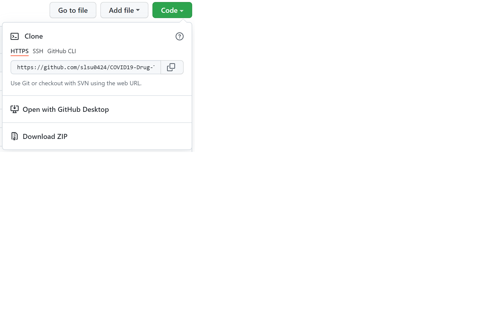

# US COVID-19 Drug Therapy Risk Prediction


# About this repository
The US COVID-19 Drug Therapy Risk Prediction Solution Accelerator is an end-to-end analytics platform that predicts the likelihood of a patient to experience a fatal adverse event (death) after receiving drug therapy for COVID-19.  The solution incorporates real-world data from the [State Drug Utilization Database](https://www.medicaid.gov/medicaid/prescription-drugs/state-drug-utilization-data/index.html) (SDUD) and the [FDA Adverse Events Database](https://www.fda.gov/drugs/drug-approvals-and-databases/fda-adverse-event-reporting-system-faers) (FAERS).   

The solution uses the SDUD data to first build a retrospective analysis to identify drug prescription trends between the years 2018-2021, particularly during the onset of COVID-19 in 2019.  Next, a prospective analysis looks at FDA adverse events associated with these drugs between 2019-2021.  A machine learning (ML) model is built to predict the likelihood of a fatal adverse event, and identify the patient characteristics associated with this outcome.    

The user experience of the solution covers multiple personas, ranging from backend engineers to frontend clinical users.  A Data Engineer is provided with a low-code, no-code experience to ingest SDUD and FAERS data.  A Data Architect is provided with an analytics platform to protect sensitive patient information for operational reporting.  The Data Analyst uses a visualization platform to plot trends observed in the data.  Professional Data Scientists and Citizen Data Scientists have the ability to build and train machine learning models using traditional and/or automated ML methods, and register and deploy the model for real-time inferencing.  Finally, a clinician can input patient characteristics in a web-based interface to assess the risk associated with a specific drug therapy. 

## Architecture Overview
The architecture diagram below details what will be built with this Solution Accelerator.


## Video Overview
The video provides a detailed walkthrough of the Solution Accelerator.  


## Prerequisites
To use this solution accelerator, you will need to have access to and/or provision the following applications:

1. Access to an [Azure Subscription ](http://portal.azure.com)
2. [Power Apps](http://www.powerapps.com) License (or free trial)
3. [PowerShell 7.1](https://docs.microsoft.com/en-us/powershell/scripting/install/installing-powershell?view=powershell-7.1)
4. [Azure CLI](https://docs.microsoft.com/en-us/cli/azure/install-azure-cli)

While not required, a working knowledge of Azure, Azure Data Factory, Azure Databricks, Azure Synapse Analytics, Azure Machine Learning, Azure Container Services, and PowerBI will be helpful.  To learn more about these services, please visit:
1. [Azure Data Factory](https://azure.microsoft.com/en-us/services/data-factory/)
2. [Azure Databricks](https://azure.microsoft.com/en-us/services/databricks/)
3. [Azure Synapse Analytics](https://azure.microsoft.com/en-us/services/synapse-analytics/)
4. [Azure Machine Learning](https://azure.microsoft.com/en-us/services/machine-learning/)
5. [Azure Container Instances](https://azure.microsoft.com/en-us/services/container-instances/)
5. [PowerBI](https://azure.microsoft.com/en-us/services/kubernetes-service/)


## Getting Started
1. An ARM template deploys and configures all the resources required to run the solution.  Click the Deploy to Azure button below:

    [](https://portal.azure.com/#create/Microsoft.Template/uri/https%3A%2F%2Fraw.githubusercontent.com%2Fslsu0424%2FCOVID19-Drug-Therapies%2Fmain%2F02-Deployment%2Fcovid_azuredeploy.json)

    The only 2 required parameters during the set-up are:

    - **Admin Password** for the Synapse Dedicated SQL Pool being deployed.
    - **Prefix ID** to preface the resources with a unique name you can later reference.

2. Clone or download this repository and navigate to the project's root directory.

    Option 1: In Windows Terminal, clone the GitHub repo:

      ```bash
      git clone https://github.com/slsu0424/COVID19-Drug-Therapies.git
      ```

    Option 2: Navigate towards the top right of this screen, and expand the **Code** button menu:

      

  
3. Go to the [Deployment Guide](./02-Deployment/Deployment.md) under [./02-Deployment](./02-Deployment) for a step-by-step tutorial to complete the solution setup.

  > **NOTE**: Be sure to manually pause the SQL pool when you are not using it from the Synapse Workspace to reduce cost. Follow the steps below to pause the SQL pool:  
  > * Navigate to the Synapse workspace
  > *  Go to `Manage` > `SQL pools` > Pause the SQL pool 

## Folders
## [01-Presentations](./Presentations)
This folder contains Powerpoint decks that provide an Executive Overview and Technical Design for the solution.

## [02-Deployment](./Deployment/Deployment)
The resources in this folder is used to deploy the required resources into your Azure Subscription. This can be done using the Azure Portal.

## [03-Data Engineering](./DataEngineering)
This folder contains the code needed to complete this solution accelerator. Once you have deployed all the required resources from [Resource Deployment](./Resource_Deployment/README.md), run through the Notebooks following the instructions in Resource Deployment.

## [04-Operational Analytics](./Analytics_Deployment)
This folder contains the Notebooks needed to complete this solution accelerator. Once you have deployed all the required resources from [Resource Deployment](./Resource_Deployment/README.md), run through the Notebooks following the instructions in Resource Deployment.

## [05-Frontend](./Frontend_Deployment)
This folder contains the Web-based User Interface to be used by a clinician.

## Contributing

This project welcomes contributions and suggestions.  Most contributions require you to agree to a
Contributor License Agreement (CLA) declaring that you have the right to, and actually do, grant us
the rights to use your contribution. For details, visit https://cla.opensource.microsoft.com.

When you submit a pull request, a CLA bot will automatically determine whether you need to provide
a CLA and decorate the PR appropriately (e.g., status check, comment). Simply follow the instructions
provided by the bot. You will only need to do this once across all repos using our CLA.

This project has adopted the [Microsoft Open Source Code of Conduct](https://opensource.microsoft.com/codeofconduct/).
For more information see the [Code of Conduct FAQ](https://opensource.microsoft.com/codeofconduct/faq/) or
contact [opencode@microsoft.com](mailto:opencode@microsoft.com) with any additional questions or comments.

## Trademarks

This project may contain trademarks or logos for projects, products, or services. Authorized use of Microsoft
trademarks or logos is subject to and must follow
[Microsoft's Trademark & Brand Guidelines](https://www.microsoft.com/en-us/legal/intellectualproperty/trademarks/usage/general).
Use of Microsoft trademarks or logos in modified versions of this project must not cause confusion or imply Microsoft sponsorship.
Any use of third-party trademarks or logos are subject to those third-party's policies.
